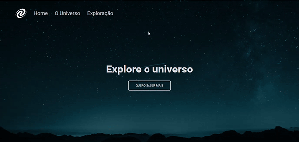

<h1 align="center"> SPA | Universe </h1>

A brief description of the universe in a single page application.

  <a href="#-demonstration">Demonstration</a>&nbsp;&nbsp;&nbsp;|&nbsp;&nbsp;&nbsp;
  <a href="#-technologies">Technologies</a>&nbsp;&nbsp;&nbsp;|&nbsp;&nbsp;&nbsp;
  <a href="#-learnings">Learnings</a>&nbsp;&nbsp;&nbsp;|&nbsp;&nbsp;&nbsp;
  <a href="#-improvements">Improvements</a>&nbsp;&nbsp;&nbsp;|&nbsp;&nbsp;&nbsp;
  <a href="#-layout">Layout</a>&nbsp;&nbsp;&nbsp;|&nbsp;&nbsp;&nbsp;
  <a href="#-feedback">Feedback</a>&nbsp;&nbsp;&nbsp;|&nbsp;&nbsp;&nbsp;
  <a href="#-author">Author</a>&nbsp;&nbsp;&nbsp;|&nbsp;&nbsp;&nbsp;
  <a href="#-deploy">Deploy</a>

## 💁🏻‍♂️ Demonstration

## 🛠 Technologies

> Front-end: 

- HTML
- CSS
- JavaScript

## 📚 Learnings

Concepts of SPA, utilization of Event.preventDefault(), properties of JavaScript for show routes, asynchrony, promises, concepts of objects oriented programming, class in JavaScript, heritage, polymorphism.

## 📈 Improvements

Refactorings, performance and accessibility.

## 🎨 Layout

You can view the layout of the project through [THIS LINK](https://www.figma.com/file/gpqavL469k0pPUGOmAQEM9/Explorer-Lab-%2301/duplicate). You need an account on [Figma](https://figma.com) to access it.

## 🙂 Feedback

If you have any feedback, please send it to me at ricardodev10@yahoo.com

## 💛 Author

Made with ♥ by [Ricardo Junior](https://www.linkedin.com/in/ricardodev10/) :wave:

## 🚀 Deploy

https://spa-universe-ricardodev10.netlify.app/